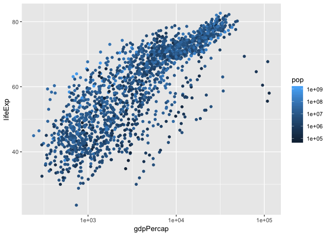

```r
library(gapminder)
library(ggplot2)
```


# Beyond the x and y aesthetics

Switch focus to exploring aesthetic mappings, instead of geoms. 

## Shapes

- Try a scatterplot of `gdpPercap` vs `pop` with a categorical variable (continent) as `shape`.
    

```r
gvsl <- ggplot(gapminder ,aes(gdpPercap,lifeExp)) + scale_x_log10()

gvsl + geom_point(aes(shape=continent), alpha = 0.2)
```

<!-- -->

- As with all (?) aesthetics, we can also have them _not_ as aesthetics!
    - Try some shapes: first as integer from 0-24, then as keyboard characters.
    - What's up with `pch`?
    
    

```r
gvsl + geom_point(shape = 7)
```

<!-- -->

```r
gvsl + geom_point(pch = 7)
```

<!-- -->

```r
gvsl + geom_point(shape = "$")
```

<!-- -->

List of shapes can be found [at the bottom of the `scale_shape` documentation](https://ggplot2.tidyverse.org/reference/scale_shape.html).

## Colour

Make a scatterplot. Then:

- Try colour as categorical variable.


```r
gvsl + geom_point(aes(colour = continent))
```

<!-- -->

- Try `colour` and `color`. 
- Try colour as numeric variable.
    - Try `trans="log10"` for log scale.
    

```r
gvsl + geom_point(aes(colour = pop)) + scale_colour_continuous(trans = "log10")
```

<!-- -->

```r
gvsl + geom_point(aes(colour = lifeExp > 60))
```

<!-- -->

Make a line plot of `gdpPercap` over time for all countries. Colour by `lifeExp > 60` (remember that `lifeExp` looks bimodal?)


Try adding colour to a histogram. How is this different?


```r
ggplot(gapminder, aes(lifeExp)) + geom_histogram(aes(fill = continent))
```

```
## `stat_bin()` using `bins = 30`. Pick better value with `binwidth`.
```

<!-- -->


## Facetting

Make histograms of `gdpPercap` for each continent. Try the `scales` and `ncol` arguments. 


```r
ggplot(gapminder, aes(lifeExp)) +
  facet_wrap( ~ continent, scales = "free_x") + 
  geom_histogram()
```

```
## `stat_bin()` using `bins = 30`. Pick better value with `binwidth`.
```

<!-- -->

Remove Oceania. Add another variable: `lifeExp > 60`. 


```r
ggplot(gapminder, aes(gdpPercap)) +
  facet_grid(continent ~ lifeExp > 60) + 
  geom_histogram()
```

```
## `stat_bin()` using `bins = 30`. Pick better value with `binwidth`.
```

<!-- -->

## Bubble Plots

- Add a `size` aesthetic to a scatterplot. What about `cex`?


```r
gvsl + geom_point(aes(size = pop), alpha = 0.2)  + 
  scale_size_area() # size of the bubbles is proportional to the population
```

<!-- -->

- Try adding `scale_radius()` and `scale_size_area()`. What's better?
- Use `shape=21` to distinguish between `fill` (interior) and `colour` (exterior).


```r
gvsl + geom_point(aes(size = pop, fill = continent), shape = 21, color = "black", alpha = 0.2)
```

<!-- -->


## "Complete" plot

Let's try plotting much of the data.

- gdpPercap vs lifeExp with pop bubbles
- facet by year
- colour by continent


```r
gvsl + geom_point(aes(size = pop, color = continent)) + 
  scale_size_area() + # area proportional to pop.
  facet_wrap(~ year)
```

<!-- -->


# Continue from last time (geom exploration with `x` and `y` aesthetics)

## Path plots

Let's see how Rwanda's life expectancy and GDP per capita have evolved over time, using a path plot.

- Try `geom_line()`. Try `geom_point()`.
- Add `arrow=arrow()` option.
- Add `geom_text`, with year label. 


```r
library(dplyr)
```

```
## 
## Attaching package: 'dplyr'
```

```
## The following objects are masked from 'package:stats':
## 
##     filter, lag
```

```
## The following objects are masked from 'package:base':
## 
##     intersect, setdiff, setequal, union
```

```r
gapminder %>% 
  filter(country == "Rwanda") %>% 
  arrange(year) %>% 
  ggplot(aes(gdpPercap, lifeExp)) +
  # scale_x_log10() + 
  geom_point() + 
  geom_path(arrow = arrow())
```

<!-- -->


## Two categorical variables

Try `cyl` (number of cylinders) ~ `am` (transmission) in the `mtcars` data frame.

- Scatterplot? Jitterplot? No.
- `geom_count()`.
- `geom_bin2d()`. Compare with `geom_tile()` with `fill` aes.


```r
ggplot(mtcars, aes(factor(cyl), factor(am))) + 
  geom_bin2d()
```

<!-- -->


## Overplotting

Try a scatterplot with:

- Alpha transparency.
- `geom_hex()`
- `geom_density2d()`
- `geom_smooth()`


```r
gvsl + geom_hex()
```

<!-- -->

```r
gvsl + geom_density2d()
```

<!-- -->

```r
gvsl + geom_point(alpha = 0.1) + geom_smooth(method = "lm")
```

<!-- -->

## Bar plots

How many countries are in each continent? Use the year 2007.


1. After filtering the gapminder data to 2007, make a bar chart of the number of countries in each continent. Store everything except the geom in the variable `d`.


```r
gapminder %>% 
  filter(year == 2007) %>% 
  ggplot(aes(x = continent)) +
  geom_bar()
```

<!-- -->


2. Notice the y-axis. Oddly, `ggplot2` doesn't make it obvious how to change to proportion. Try adding a `y` aesthetic: `y=..count../sum(..count..)`.


__Uses of bar plots__: Get a sense of relative quantities of categories, or see the probability mass function of a categorical random variable.


## Polar coordinates

- Add `coord_polar()` to a scatterplot.


```r
gvsl + geom_point() + coord_polar()
```

<!-- -->


# Want more practice?

If you'd like some practice, give these exercises a try

__Exercise 1__: Make a plot of `year` (x) vs `lifeExp` (y), with points coloured by continent. Then, to that same plot, fit a straight regression line to each continent, without the error bars. If you can, try piping the data frame into the `ggplot` function.

__Exercise 2__: Repeat Exercise 1, but switch the _regression line_ and _geom\_point_ layers. How is this plot different from that of Exercise 1?

__Exercise 3__: Omit the `geom_point` layer from either of the above two plots (it doesn't matter which). Does the line still show up, even though the data aren't shown? Why or why not?

__Exercise 4__: Make a plot of `year` (x) vs `lifeExp` (y), facetted by continent. Then, fit a smoother through the data for each continent, without the error bars. Choose a span that you feel is appropriate.

__Exercise 5__: Plot the population over time (year) using lines, so that each country has its own line. Colour by `gdpPercap`. Add alpha transparency to your liking. 

__Exercise 6__: Add points to the plot in Exercise 5.
